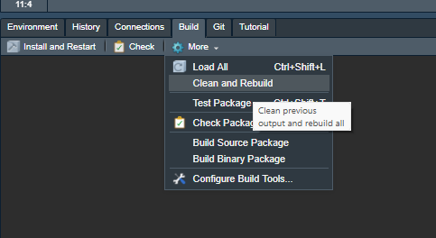
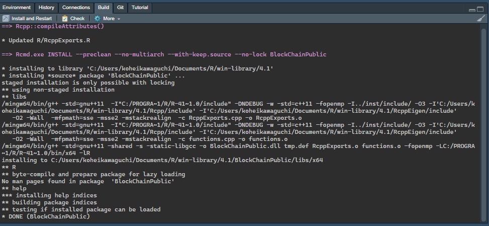

# BlockChainPublic

## Install

1. Install the latest version of R, RStudio, git, and aws cli. Install C/C++ compilers. In Windows, you can install Rtools. You also need to install python by anaconda. This project uses `reticulate::use_condaenv` to call python functions from R for running some process in the simulation.
1. Clone this git repository to your local environment by running the following in the terminal:

    ```
    git clone git@github.com:kohei-kawaguchi/BlockChainPublic.git
    ```

1. As you clone the git repository, double click the `BlockChainpublic.Rproj` to open it as a project in RStudio. Ever code is written relative to this project root folder. By starting it as an RStudio project, you can always start with this projet root folder as the current working directory.
1. Test whether you can clean and rebuild the project as an R package by clicking the clean and rebuild command from the build tab.

1. If it succeeds, the build console will show the following message. You may be required to install some R packages, such as `RcppEigen` and `Rcpp`.

1. You can load the library by `library(BlockChainPublic)` to call R functions defined in `R/` folder. C++ functions defined in `src/` folder is exported to R functions by `Rcpp`.
1. Download `cleaned/` folder and `output/` folder from aws s3 bucket by running the following command in the terminal:

    ```
    aws s3 cp s3://blockchain-kawaguchi-noda-public/cleaned cleaned --recursive
    aws s3 cp s3://blockchain-kawaguchi-noda-public/output output --recursive
    ```
  
## Folder Structure

This is a replication package for "[Security-Cost Efficiency of Competing Proof-of-Work Cryptcurrencies](https://papers.ssrn.com/sol3/papers.cfm?abstract_id=3974376)".

The folder structure is 

- `cleaned`: Store cleaned data.
- `output`: Store transformed data nd other outputs of the analysis.
- `main`: Store code for cleaning, transforming, and analyzing the data.
- `report`: Store reporting Rmd documents.
- `R`: Store R function definitions.
- `src`: Store C++ function definitions.

The files `DESCRIPTION` and `NAMESPCE` describe the meta data of this package. It does not contain the raw data, because the raw data is too large. All analysis can be replicated based on the cleaned data. `image` folder stores image files for this readme document.

## Code Structure

### Main Files

- The `main` folder contains execution files. The missing numberings are for scraping, data cleaning, and unpublished analysis. Because we do not include the raw data due to its file size, the current code is self-contained by themselves. 

- The file `main/4_make_data_blockheight.R` transforms the cleaned data for the following analysis. It combines the blockchain, reward, and exchange rate to make a currency-algo-blockheight-level data. Then, it combines the currency-algo-blockheight-level data of SHA-256 currencies to make a epoch-currency-level data and save it as `output/epoch_currency_sha256.rds`. 

- The file `main/5_estimate_arrival_rate_sha256.R` estimate the hash supply function using the epoch-currency-level data `output/epoch_currency_sha256.rds`. The file runs various specifications that are not used in the paper. The main specification we use is saved as `output/estimate_arrival_rate_after_bsv_local.rds`.

- The file `main/8_estimate_exogenous.R` estimate the exchange rate process and save the result as `output/rate_estimate.rds`.

- The file `main/9_1_simulate_reduced_btc_halving.R` uses the data `output/epoch_currency_sha256.rds`, the estimate of the exchange rate process `output/rate_estimate.rds`, and the estimate of the hash supply function `output/estimate_arrival_rate_after_bsv_local.rds` to simulate the minimg market after the third BTC halving. 

- One can change the DAA setting by changing the variable `setting`. The choice is `actual`, `original_original_cw144`, `original_original_original`, `cw144_cw144_cw_144`, `original_asert_cw144`, `original_asert_asert`, `asert_asert_asert`, `cw144_asert_asert`, `asert_asert_cw144`, and `cw144_original_original`. Except for `actual`, they represent the DAA of BTC, BCH, and BSV. The code is supposed to run batch from the command line. As one runs the code in the terminal as follows, then the `$SETTING` is passed to the file as the argument.

  ```
  Rscript main/9_1_simulate_reduced_btc_halving.R $SETTING
  ```

- The first few lines of `main/9_1_simulate_reduced_btc_halving.R` reads the argument and pass to `setting` as follows

  ```
  args <- commandArgs(trailingOnly = TRUE)
  if (length(args) > 0) {
    setting <- args[1]
  } else {
    setting <- "cw144_original_original"
  }
  ```

- The files `main/9_2_simulate_reduced_bch_halving.R` and `main/9_3_simulate_reduced_bsv_halving.R` are for the simulatino after the third BCH and BSV halving. The files `main/10_1_simulate_reduced_btc_halving_96paths.R`, `main/10_2_simulate_reduced_bch_halving_96paths.R`, and `main/10_3_simulate_reduced_bsv_halving_96paths.R` run the same simulations for 96 paths.

- The simulation files require the anaconda distribution of python 3.9. At the beginning of the code, it calls the anaconda distribution of python using `recitulate` as follows. If the if clause is true, it setup an anaconda environment named "blockchain". If the environment is already defined, it calles it in the else clause.

  ```
  if (!("blockchain" %in% reticulate::conda_list()$name)) {
    # set up python environment and install pyblp
    reticulate::conda_create(
      envname = "blockchain",
      forge = TRUE,
      python_version = "3.9"
    )
  } else {
    # load conda environment and load pyublp
    reticulate::use_condaenv("blockchain", required = TRUE)
    asert <- 
      reticulate::import_from_path(
        module = "asert",
        path = "module"
      )
  }
  ```

### Reporting Files

- `report/summarize_cleaned_data.Rmd` is a code book of the cleaned data. It describes the definition of each variable of each cleaned data set. 

- `report/analyze_sha256.Rmd` compares the time series of SHA-256 currencies' data. 

- `report/describe_exchange.Rmd` examines the distribution of the exchange rate. 

- `report/describe_simulator.Rmd` checks whether the our simulator can replicate the data, especially for the difficulty adjustment. 

- `report/summarize_arrival_rate_rdd.Rmd` reports the SHA-256 around the halving and run a regression discontinuity analysis, and `report/arrival_rate.Rmd` reports the estimation result of the hash supply function. 

- `report/summarize_simulate_reduced_halving.Rmd` reports the simulation results.

- `report/summarize_security_cost.Rmd` summarizes the simulation results from the security-cost perspective. 

## Table and Figures

- Table 1 and 2 are generated in `report/summarize_cleaned_data.Rmd`.
- Figure 2 is generated in `report/analyze_sha256.Rmd`.
- Figures 3, 4, A1, A2, A3, and A4, and Table 3, A1, and A2, are generated in `report/summarize_arrival_rate_rdd.Rmd`.
- Table 4 is generated in `report/summarize_arrival_rate.Rmd`.
- Table 5 is generated in `report/describe_exchange.Rmd`.
- Figure 5, 6, and 7 are generated in `report/summarize_simulate_reduced_halving.Rmd`.
- Table 9, 10, A4, A5, and A6, are generated in `report/summarize_security_cost.Rmd`.


